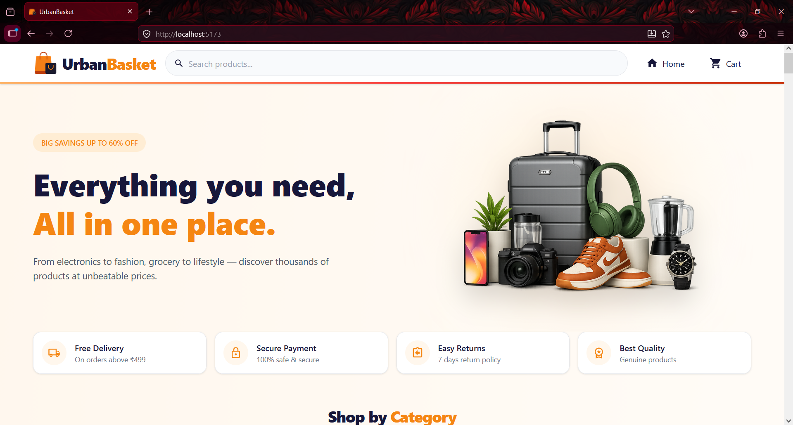
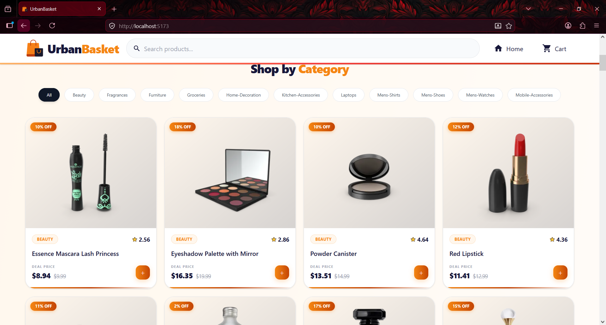
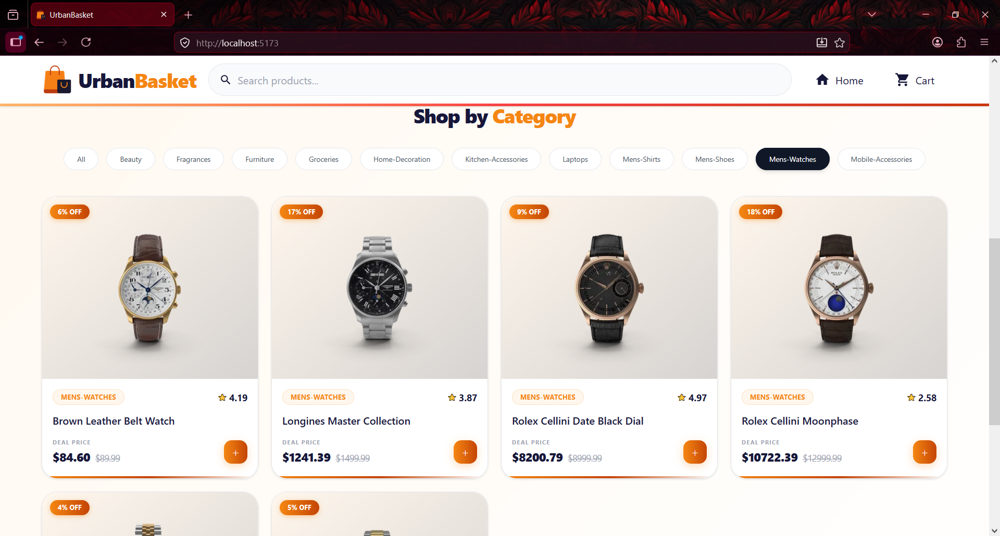
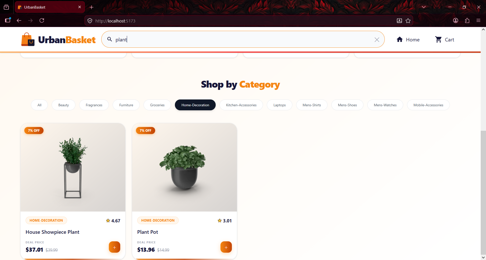
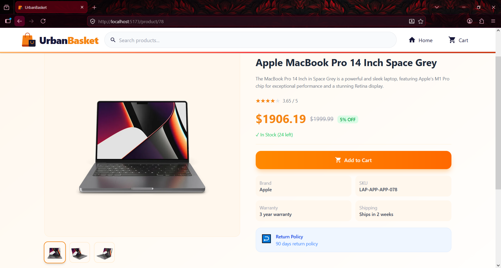
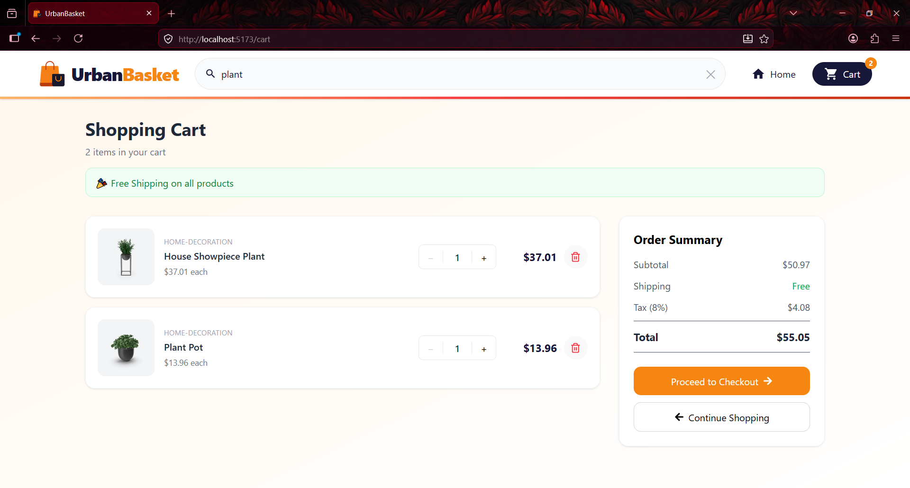
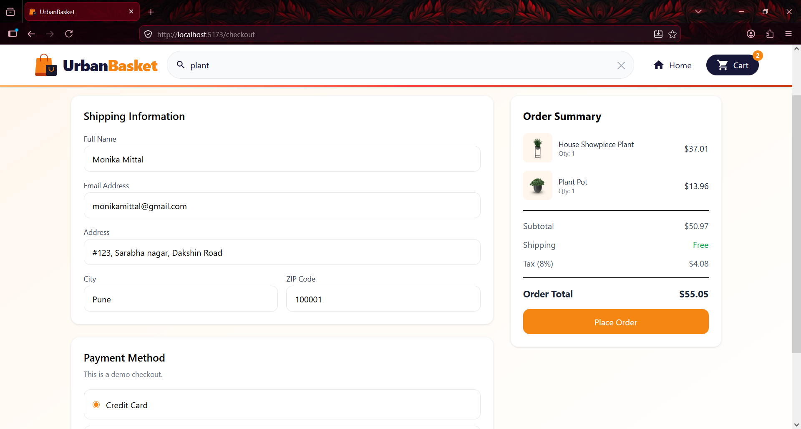
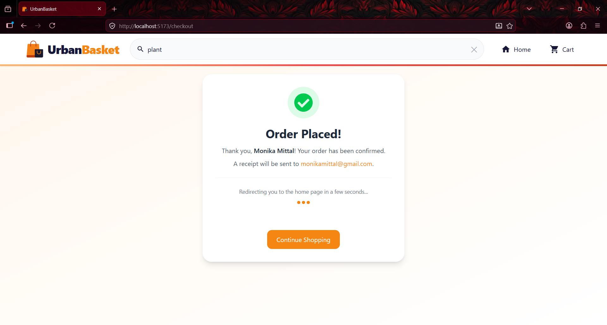
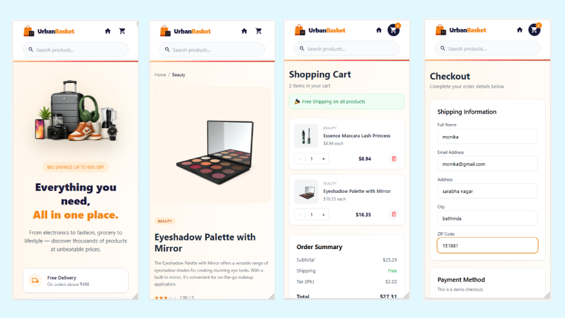

# 🛒 UrbanBasket

A modern, responsive e-commerce web application built with React, featuring product browsing, live search, category filtering, cart management, and a checkout flow.



---

## 🔗 Links

- **GitHub:** [github.com/monikamittal-1728/UrbanBasket](https://github.com/monikamittal-1728/UrbanBasket)

---

## 🚀 Features

### Product Management

* Fetch products from DummyJSON API
* View all available products
* Product detail page
* Category-based product filtering
* Product search functionality
* Loading skeletons while fetching data
* Error handling for API failures

### Shopping Cart

* Add products to cart
* Remove products from cart
* Increase product quantity
* Decrease product quantity
* Prevent quantity from going below 1
* Dynamic cart item count in header
* Cart subtotal calculation
* Tax calculation
* Order total calculation

### Checkout

* Shipping information form
* Form validation
* Payment method selection
* Order summary
* Order confirmation page
* Automatic redirection after order placement

### Routing

* Home Page
* Product Details Page
* Cart Page
* Checkout Page
* Order Success Page
* Custom 404 Not Found Page

### Performance Optimizations

* React Lazy Loading
* Suspense Fallbacks
* Skeleton Loaders
* Custom Hooks
* Redux State Management

### Responsive Design

* Mobile Friendly
* Tablet Friendly
* Desktop Friendly

---

## 📸 Screenshots

### Homepage


### Product Section


### Shop by Category


### Search Products


### Product Detail


### Cart


### Checkout


### Order Confirmed & Auto Redirect


### Mobile View


---

## 🛠️ Tech Stack

| Technology | Purpose |
|---|---|
| React | UI library |
| Vite | Build tool & dev server |
| React Router DOM | Client-side routing with lazy loading |
| Redux Toolkit | Global cart state management |
| Tailwind CSS | Utility-first styling |
| DummyJSON API | Product data source |
| PropTypes | Runtime prop validation |

---

## 📁 Project Structure

```
UrbanBasket/
├── public/
│   └── logo.png
│
├── src/
│   │
│   ├── components/
│   │   │
│   │   ├── cart/
│   │   │   ├── CartItem.jsx
│   │   │   └── EmptyCart.jsx
│   │   │
│   │   ├── home/
│   │   │   ├── CategoryFilter.jsx
│   │   │   ├── EmptyState.jsx
│   │   │   ├── HeroSection.jsx
│   │   │   ├── ProductList.jsx
│   │   │   └── TrustStrip.jsx
│   │   │
│   │   ├── CheckoutDone.jsx
│   │   ├── Header.jsx
│   │   ├── PageLoader.jsx
│   │   ├── ProductDetailSkeleton.jsx
│   │   └── ProductItem.jsx
│   │
│   ├── hooks/
│   │   └── useProducts.js
│   │
│   ├── pages/
│   │   ├── Home.jsx
│   │   ├── ProductDetail.jsx
│   │   ├── Cart.jsx
│   │   ├── Checkout.jsx
│   │   └── NotFound.jsx
│   │
│   ├── store/
│   │   ├── store.js
│   │   ├── cartSlice.js
│   │   └── searchSlice.js
│   │
│   ├── App.jsx
│   ├── App.css
│   ├── index.css
│   └── main.jsx
│
├── index.html
├── package.json
├── tailwind.config.js
├── vite.config.js
└── README.md
```

---

## 🚀 Getting Started

### Prerequisites

- Node.js v18+
- npm or yarn

### Installation

```bash
# Clone the repository
git clone https://github.com/monikamittal-1728/UrbanBasket.git

# Navigate into the project
cd UrbanBasket

# Install dependencies
npm install

# Start the development server
npm run dev
```

Open [http://localhost:5173](http://localhost:5173) in your browser.

### Build for Production

```bash
npm run build
```

---

## 🔌 API

Product data is fetched from [DummyJSON](https://dummyjson.com/).

```
GET https://dummyjson.com/products?limit=100&select=id,title,price,thumbnail,category,rating,description,images,stock,discountPercentage
GET https://dummyjson.com/products/:id
```

---

## 📦 Key Implementation Details

- **Lazy loading** — All page components are code-split with `React.lazy` and `Suspense`
- **Optimized API** — Uses `select` query param to fetch only required fields
- **Discounted pricing** — Calculated consistently across product card, detail page, and cart
- **Cart persistence** — Managed via Redux Toolkit with quantity controls
- **PropTypes validation** — All components have runtime prop validation

---

## 👩‍💻 Author

**Monika Mittal**
- GitHub: [@monikamittal-1728](https://github.com/monikamittal-1728)

---

## 📄 License

This project is open source and available under the [MIT License](LICENSE).